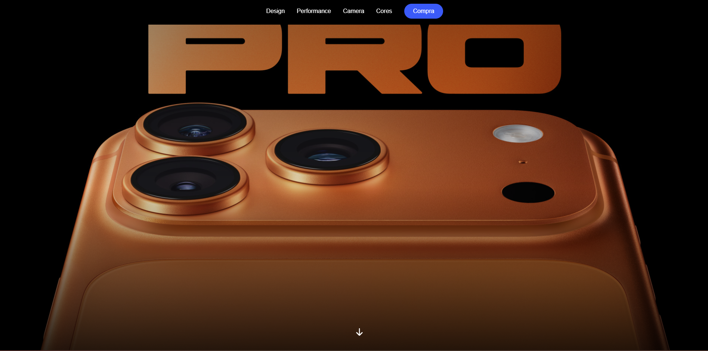
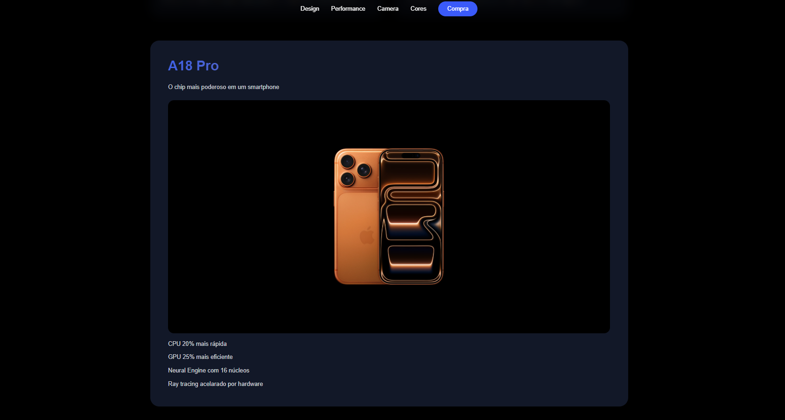
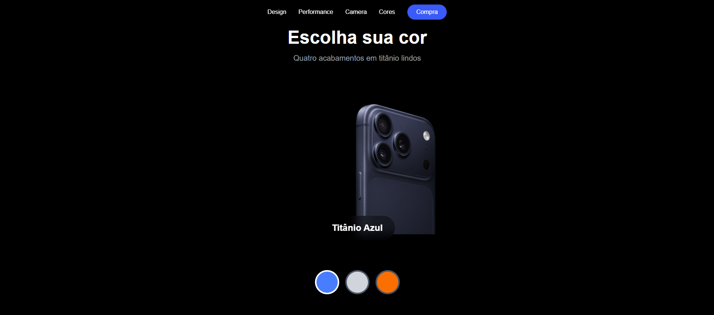

# Site Apple

Projeto front-end desenvolvido com React, Vite e Tailwind CSS, recriando um site inspirado na Apple com foco em design moderno, visual elegante, responsividade e uma experiência de navegação fluida para apresentar produtos de forma sofisticada.

## Preview

### Página inicial


<br>

### Página de design


<br>

### Página de performance


<br>

### Página da câmera


<br>

### Página de cores


<br>

## Sobre o projeto

Este projeto foi criado para praticar a construção de interfaces modernas usando componentes React, estilização com Tailwind CSS e organização visual inspirada em páginas de produtos da Apple.

A proposta do site é apresentar uma experiência limpa, sofisticada e responsiva, com foco em imagens, contraste, tipografia marcante e seções bem definidas.

## Tecnologias utilizadas

- React
- Vite
- Tailwind CSS
- JavaScript
- HTML
- CSS

## Funcionalidades

- Layout inspirado na identidade visual da Apple
- Interface responsiva
- Seções organizadas por componentes
- Efeitos visuais com Tailwind CSS
- Imagens e cards de destaque para apresentação do produto

## Como executar o projeto

Clone o repositório:

```bash
git clone URL_DO_REPOSITORIO
```

Acesse a pasta do projeto:

```bash
cd site-apple
```

Instale as dependências:

```bash
npm install
```

Execute o projeto:

```bash
npm run dev
```

Abra no navegador o endereço exibido no terminal.

## Build

Para gerar a versão de produção:

```bash
npm run build
```

## Autor

Desenvolvido por Matheus Silva.
